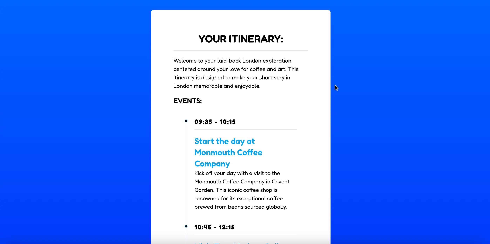

<div align="center">
    
</div>

<div align="center">
<h1>WAYGENIE</h1>
</div>

<h4 align="center">
  <a href="https://d1tl42qtzfxokv.cloudfront.net">Live Demo</a> |
  <a href="#features">Features</a> |
  <a href="#quick-start">Quick Start</a>
</h4>

<div align="center">
  <h2>
    An AI-powered travel itinerary planner built with React.js and Express.js. </br>
    Helping travelers create personalized journeys with intelligent suggestions. </br>
  <br />
  </h2>
</div>

<br />
<p align="center">
  <a href="https://github.com/dandyson/waygenie/blob/master/LICENSE">
    
  </a>
  <a href="https://github.com/dandyson/waygenie/actions/workflows/deploy.yml">
    
  </a>
  <a href="https://github.com/dandyson/waygenie/pulls">
    
  </a>
  <a href="https://github.com/dandyson/waygenie/issues">
    
  </a>
</p>

<div align="center">
  <figure>
    
    <figcaption>
      <p align="center">
        An intuitive interface designed to help travelers create personalized itineraries with AI-powered suggestions.
      </p>
    </figcaption>
  </figure>
</div>

## Features

WayGenie provides a comprehensive suite of features for travel planning:

- 🤖 **AI-Powered Itinerary Planning**: Intelligent suggestions and personalized travel recommendations
- 🔒 **Secure Authentication**: Auth0 integration for protected API routes
- ⚡ **Queue Management**: Redis-based job queue system
- 🧪 **Comprehensive Testing**: 
  - Cypress for end-to-end testing
  - Jest for unit testing
- 🚀 **Performance & Scalability**:
  - AWS CloudFront for content delivery
  - Optimized API routes with:
    - CORS configuration for secure cross-origin requests
    - Rate limiting and request validation
    - Redis caching for frequent queries
    - Queue-based processing for AI operations
  - Responsive design

## Quick Start

**Note:** These instructions are for running WayGenie locally. The app is currently just a demo version, so some of the features (such as registering users) has been turned off.

### Prerequisites

- Node.js and npm
- Redis (optional for AI features)

### Installation

1. Clone the repository:
```bash
git clone https://github.com/dandyson/waygenie.git
cd waygenie
```

2. Set Up the Backend:
```bash
cd backend
npm install
npm start
```

3. Set Up the Frontend:
```bash
cd ../frontend
npm install
npm start
```

4. Access the Application:
- Frontend: http://localhost:3000
- Backend API: http://localhost:5000

## Testing

### React Scripts/Jest
```bash
cd frontend
npm run test
```

For coverage:
```bash
npm run test:total
```

### Cypress E2E Testing
```bash
cd frontend
npm run cypress
```

## Technical Stack

- **Frontend**: React.js, React Router
- **Backend**: Express.js, Node.js
- **Authentication**: Auth0
- **Queue Management**: Redis
- **Testing**: Cypress, Jest
- **CDN**: AWS CloudFront
- **AI**: OpenAI API

## Contributing

We welcome contributions! Here's how you can help:

- Found a bug? [Report it here](https://github.com/dandyson/waygenie/issues)
- Have a feature request? [Open an issue](https://github.com/dandyson/waygenie/issues)

## Contact

For full demo access or questions about this project, please reach out to dannydyson297@gmail.com

## License

WayGenie is open-source software licensed under the [MIT license](LICENSE).
