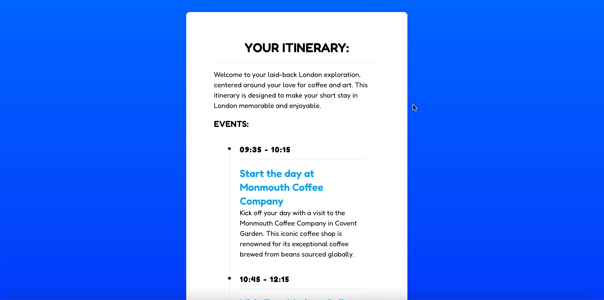

<div align="center">
    
</div>

<div align="center">
<h1>WAYGENIE</h1>
</div>

<h4 align="center">
  <a href="https://waygenie.pages.dev/">Live Demo</a> |
  <a href="#features">Features</a> |
  <a href="#quick-start">Quick Start</a>
</h4>

<div align="center">
  <h2>
    An AI-powered travel itinerary planner built with React.js and Express.js. </br>
    Helping travelers create personalized journeys with intelligent suggestions. </br>
  <br />
  </h2>
</div>

<br />
<p align="center">
  <a href="https://github.com/dandyson/waygenie/blob/master/LICENSE">
    
  </a>
  <a href="https://github.com/dandyson/waygenie/actions/workflows/deploy.yml">
    
  </a>
  <a href="https://github.com/dandyson/waygenie/issues">
    
  </a>
</p>

<div align="center">
  <figure>
    
    <figcaption>
      <p align="center">
        An intuitive interface designed to help travelers create personalized itineraries with AI-powered suggestions.
      </p>
    </figcaption>
  </figure>
</div>

## Features

WayGenie provides a comprehensive suite of features for travel planning:

- 🤖 **AI-Powered Itinerary Planning**: Intelligent suggestions and personalized travel recommendations
- 🔒 **Secure Authentication**: Auth0 integration for protected API routes
- ⚡ **Queue Management**: Redis-based job queue system
- 🧪 **Comprehensive Testing**: 
  - Cypress for end-to-end testing
  - Vitest for unit testing
- 🚀 **Performance & Scalability**:
  - Cloudflare pages for content delivery
  - Optimized API routes with:
    - CORS configuration for secure cross-origin requests
    - Rate limiting and request validation
    - Redis caching for frequent queries
    - Queue-based processing for AI operations
  - Responsive design

## Quick Start

**Note:** These instructions are for running WayGenie locally. This is a demo instance - to explore the full app, clone the repo and run it locally using the instructions below

### Prerequisites

- Node.js 20.19+ (or 22.12+) and npm
- Redis (required for AI itinerary generation)

### Installation

1. Clone the repository:
```bash
git clone https://github.com/dandyson/waygenie.git
cd waygenie
```

2. Copy .env files for both frontend and backend - navigate to /frontend and /backend and for each, run:
```bash
cp .env.example .env
```
Then fill in the values - the comments in each `.env.example` explain where to find them.

3. Set Up the Backend:
```bash
cd backend
npm install
npm start
```

4. Set Up the Frontend:
```bash
cd ../frontend
npm install
npm run dev
```

5. Access the Application:
- Frontend: http://localhost:3000
- Backend API: http://localhost:5000

## Testing

### Vitest
```bash
cd frontend
npm run test
```

For a single run (no watch mode):
```bash
npm run test:ci
```

For coverage:
```bash
npm run test:coverage
```

### Cypress E2E Testing
```bash
cd frontend
npm run cypress
```

## Technical Stack

- **Frontend**: React.js, React Router, Vite
- **Backend**: Express.js, Node.js
- **Authentication**: Auth0
- **Queue Management**: Redis
- **Testing**: Cypress, Vitest
- **CDN**: Cloudflare Pages
- **Hosting**: Railway
- **AI**: OpenAI API

## License

WayGenie is open-source software licensed under the [MIT license](LICENSE).
